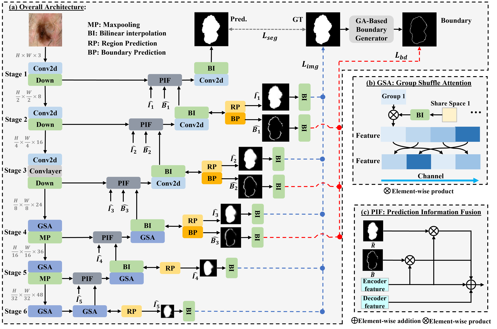
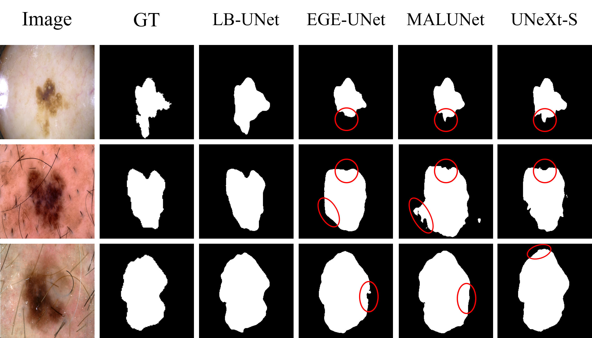

# LB-UNet
PyTorch implementation for LB-UNet: A Lightweight Boundary-assisted UNet for Skin Lesion Segmentation (LB-UNet) (MICCAI 2024)

## Network Architecture



## Environments

1. torch 2.1.0

2. torchvision 0.16.0

3. python 3.8.0

## Dataset
The dataset utilizes the preprocessed datasets provided by [EGE-UNet](https://github.com/JCruan519/EGE-UNet) from [Google Drive](https://drive.google.com/file/d/1J6c2dDqX8qka1q4EtmTBA0w3Kez7-M6T/view?usp=sharing).

The boundary maps that you can generate using ```boundary.py``` or download from Google Drive.
[ISIC2017](https://drive.google.com/file/d/1NfPPWOWDbOKltjUKvZSFoaxtP5gD0mQu/view?usp=sharing), [ISIC2018](https://drive.google.com/file/d/1YTO1Ge6yQBnDz79L-Qiuqg8w_TW6O9AM/view?usp=sharing).

## Code

1. Update the input and output paths for ```Boundary.py``` to align with the directory structure of ```dataset.py```.

2. Run ```Boundary.py``` to generate boundary maps.

3. Update the data_path configuration in ```config_setting.py```.

4. Run ```train.py``` to train the model.

## Visualization



